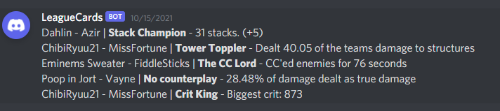

# League Cards

This repository started off focusing on a providing support of a league minigame called 'Stack Battles'. This minigame invovles playing ARAMS and taking the Dark Harvest keystone. To win the game, simply get the most Dark Harvest stacks by the end of the ARAM. Winner gets the honor. 

While working on generating a useful discord bot to help facilitate 'Stack Battles', we thought of extending the functionality to mimic the end of game cards that exist in other games like Overwatch and CS:GO. Currently, the number and type of cards is pretty limited, but over time we are adding additional cards.

The current use of this repository is running the `cards_msg_discord.py` script while playing games. This script will send a message to the specified channel after the game completes with a message similar to below

